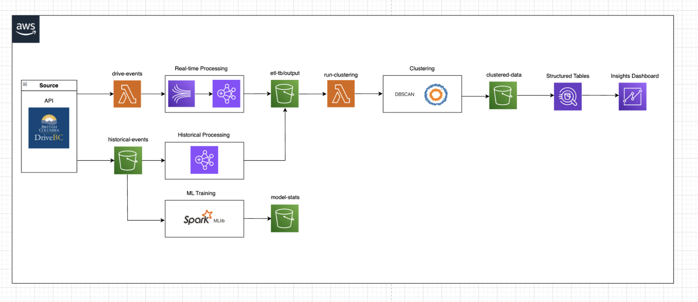

## Project Description

The Road Incident Analytics System processes live road incident data from DriveBC, leveraging Spark Streaming, AWS (Kinesis, Lambda, EMR, S3, Athena, QuickSight), and SparkML to predict and visualize accident risks. The system ingests active incidents, processes and stores data in S3 in parquet format, trains an ML model using historical data, and visualizes clusters in QuickSight.

## Technologies

- DriveBC API
- Python
- SQL
- Apache Spark
- Kinesis Data Stream
- Lambda
- EMR
- S3
- Athena
- QuickSight
- DBScan

## Data Pipeline

## Dashboard

